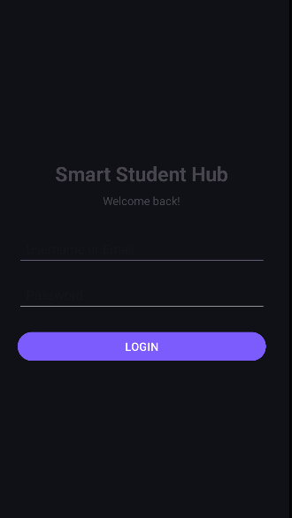
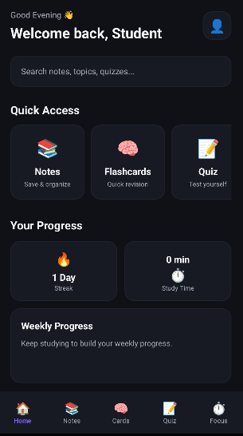
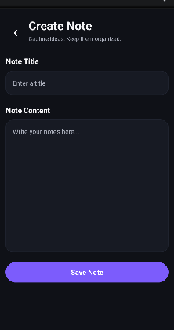
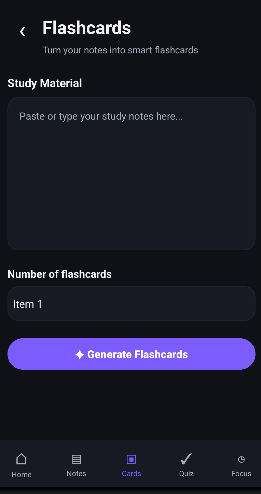
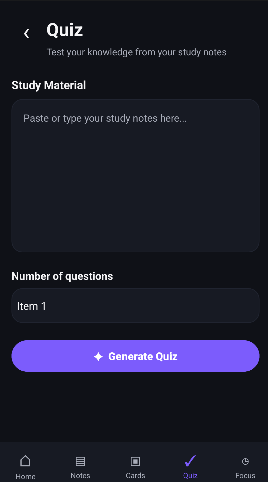
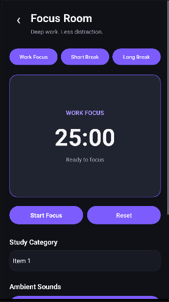
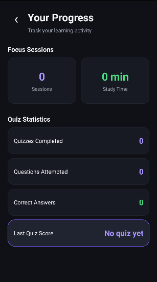
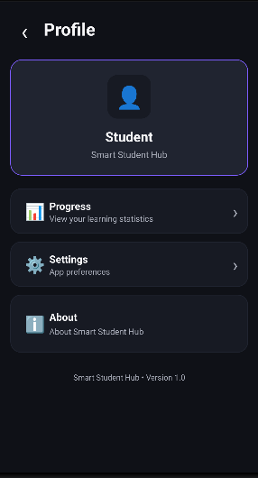
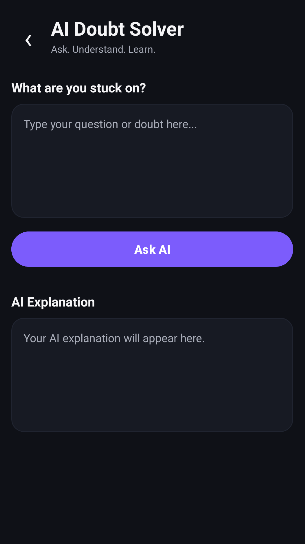

# 📚 Smart Student Hub

### Learn • Revise • Focus • Track

Smart Student Hub is an Android-based learning application designed to bring essential study tools into one focused workspace.

The application helps students organize their study material, revise concepts using flashcards, practice through quizzes, maintain focused study sessions, and monitor their learning progress.

> **One workspace for everyday learning.**

---

## 🎯 Project Overview

Students often use multiple applications for different parts of their study routine — one for notes, another for revision, another for quizzes, and another for study timers.

**Smart Student Hub** aims to bring these activities together into a single Android application.

The project focuses on creating a simple but structured learning environment where students can:

- 📝 Organize their study notes
- 🧠 Revise concepts using flashcards
- 🎯 Practice through quizzes
- ⏱️ Conduct focused study sessions
- 📊 Monitor learning progress
- 🤖 Access an interface for solving academic doubts

---

## ✨ Key Features

### 🔐 Student Login

The application starts with a login screen where the student enters their ID and password.

The entered student ID is stored locally and can be used within the application.

---

### 🏠 Home Dashboard

The Home Dashboard provides quick access to the major learning features.

It includes:

- Notes
- Flashcards
- Quiz
- Focus Room
- AI Doubt Solver
- Progress information
- Profile access

The dashboard is designed to keep the most frequently used learning tools easily accessible.

---

### 📝 Notes Management

The Notes module allows students to create and manage their study material.

#### Features

- Create notes
- Add title and content
- View saved notes
- Edit existing notes
- Delete notes
- Access notes from the learning workflow

This allows students to keep their study material inside the application instead of maintaining separate files for every subject.

---

### 🧠 Flashcards

The Flashcards module provides a quick revision method.

Students can:

- Enter study material
- Select the required number of flashcards
- Generate flashcards
- Navigate between cards
- Reveal answers
- Move forward and backward during revision

Flashcards are intended for quick recall and concept revision.

---

### 🎯 Quiz Module

The Quiz module provides multiple-choice practice based on study material.

#### Features

- Select the number of questions
- Attempt multiple-choice questions
- Navigate between questions
- View answer feedback
- Calculate the final score
- Store quiz performance locally

The quiz statistics contribute to the Progress section of the application.

---

### ⏱️ Focus Room

Focus Room is designed for distraction-free study sessions.

It includes:

- Work Focus session
- Short Break
- Long Break
- Countdown timer
- Study category selection
- Focus session statistics
- Total study time tracking

The purpose of Focus Room is to help students structure their study time instead of studying without a defined session.

---

### 📊 Progress Tracking

The Progress section provides an overview of the student's learning activity.

The application tracks information such as:

- Total focus sessions
- Total study time
- Quizzes completed
- Questions attempted
- Correct answers
- Latest quiz score

This provides students with a basic view of their learning activity.

---

### 👤 Profile

The Profile section provides access to:

- Student progress
- Settings
- About information

It acts as a central place for student-related application options.

---

### 🤖 AI Doubt Solver

Smart Student Hub includes a dedicated AI Doubt Solver interface where students can enter an academic question or doubt.

The current project contains the interface and interaction flow for this feature.

The architecture can be extended with a real AI service/API for generating responses.

---

# 📱 Application Screenshots

## 🔐 Login

---

## 🏠 Home Dashboard

---

## 📝 Notes

---

## 🧠 Flashcards

---

## 🎯 Quiz

---

## ⏱️ Focus Room

---

## 📊 Progress

---

## 👤 Profile

---

## 🤖 AI Doubt Solver

---

# 🔄 Application Workflow

The basic flow of the application is:

**Login → Home Dashboard → Select a Feature**

From the Home Dashboard, the user can access:

- 📝 Notes — create, edit, view and manage notes
- 🧠 Flashcards — revise topics using flashcards
- 🎯 Quiz — practice questions and check scores
- ⏱️ Focus Room — start a focused study session
- 📊 Progress — view study and quiz activity
- 👤 Profile — access profile-related options
- 🤖 AI Doubt Solver — enter an academic doubt

The user can move between the main sections using the navigation provided in the application.

com.example.smartstudenthub
│
├── LoginActivity
│
├── MainActivity
│
├── NotesActivity
├── AddNoteActivity
├── ViewNoteActivity
│
├── FlashcardsActivity
├── GeneratedFlashcardActivity
│
├── QuizActivity
├── GeneratedQuizActivity
│
├── FocusRoomActivity
│
├── ProgressActivity
│
├── ProfileActivity
│
└── AiDoubtActivity

| Technology            | Purpose                              |
| --------------------- | ------------------------------------ |
| **Kotlin**            | Primary Android programming language |
| **Android Studio**    | Application development              |
| **XML**               | User interface layouts               |
| **Gradle**            | Build and dependency management      |
| **SharedPreferences** | Local data storage                   |
| **Android SDK**       | Android application framework        |

💾 Data Storage

The current version of Smart Student Hub uses Android SharedPreferences for local data storage.

The application stores information including:

Student ID
Notes
Quiz statistics
Questions attempted
Correct answers
Last quiz score
Focus sessions
Total study time

🎨 UI & Design

The application follows a modern dark-themed interface.

Design characteristics
🌙 Dark theme
🟣 Purple primary accent
🃏 Card-based interface
📱 Mobile-friendly layouts
🧭 Bottom navigation
⚡ Quick-access feature cards
🔄 Consistent navigation between modules

The interface is designed to keep learning tools accessible without making the application feel like a traditional student-management system.

| Module          | Purpose                          |
| --------------- | -------------------------------- |
| Login           | Student authentication interface |
| Home            | Central learning dashboard       |
| Notes           | Study material management        |
| Flashcards      | Quick concept revision           |
| Quiz            | MCQ-based practice               |
| Focus Room      | Structured study sessions        |
| Progress        | Learning activity tracking       |
| Profile         | Student-related options          |
| AI Doubt Solver | Academic doubt interface         |

🚀 Future Scope

Smart Student Hub can be extended beyond the current local implementation.

🤖 AI Integration
Real AI-powered doubt solving
AI-generated flashcards
AI-generated quizzes
Personalized explanations
Context-aware learning assistance
☁️ Cloud Integration
Firebase Authentication
Cloud database
Cross-device synchronization
Cloud backup of notes and progress
📈 Advanced Analytics
Weekly and monthly learning reports
Subject-wise performance
Learning streaks
Study-time analytics
Personalized progress insights
🔔 Productivity Features
Study reminders
Notifications
Daily learning goals
Achievement system
Custom study schedules
🎓 Learning Outcomes

This project provides practical experience in:

Android application development
Kotlin programming
XML-based UI development
Activity and Intent-based navigation
Local data storage
User interaction handling
Timer implementation
Quiz logic and score calculation
Application UI/UX design
Structuring a multi-feature Android application
📌 Current Project Status
🟢 Core Application — Implemented

The current version includes the main application workflow and core learning modules.

🔄 Future Development

Advanced cloud functionality and real AI integration can be added as the project evolves.

👩‍💻 Developer
Prachi Vaishnav

Computer Engineering Student

Smart Student Hub was developed as an Android application project focused on improving the everyday learning workflow of students.

📄 Project Information

Project: Smart Student Hub
Platform: Android
Language: Kotlin
UI: XML
Storage: SharedPreferences
Status: Under Development

⭐ Project Vision

Smart Student Hub — Learn smarter, stay focused, and keep track of your progress.

SharedPreferences provides lightweight local key-value storage suitable for the current project implementation.
